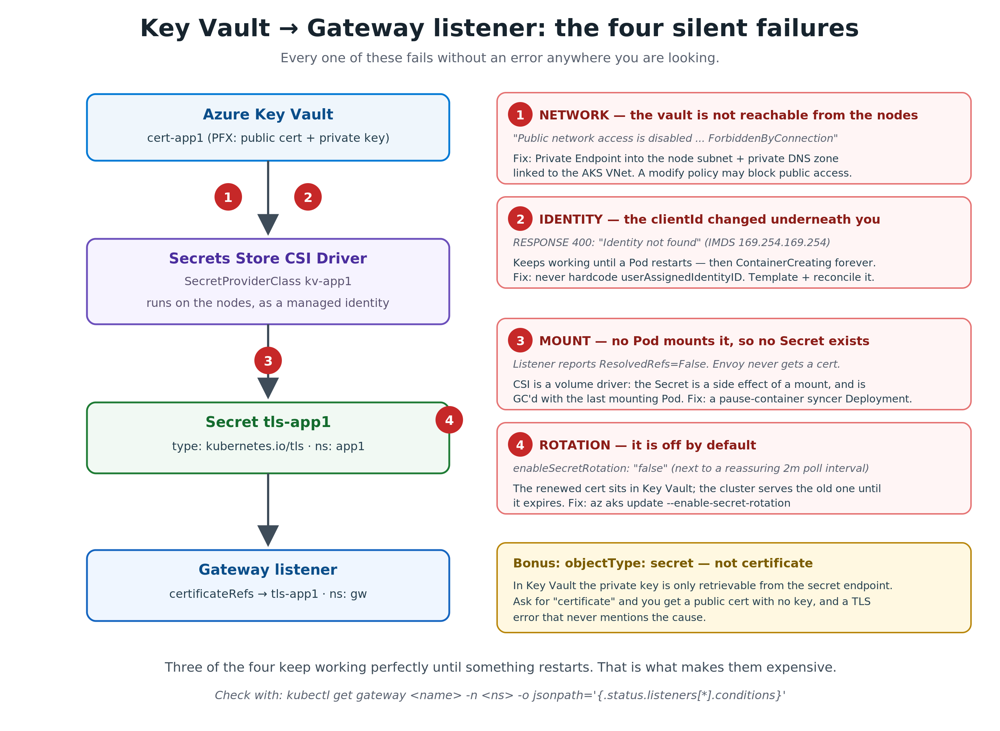

# Migrating from NGINX Ingress to Gateway API on AKS
### A field-validated playbook (multi-host, multi-cert, Key Vault-backed)

This playbook walks through replacing **NGINX Ingress Controller** with the
**Kubernetes Gateway API** on an existing AKS cluster, while keeping multiple
hostnames and per-host TLS certificates stored in **Azure Key Vault**.

It uses the **AKS Application Routing add-on with the managed Istio
Gateway API implementation** (`gatewayClassName: approuting-istio`). This is
the supported Microsoft path on AKS — no manual CRD installs, no manual
controller installs.

The procedure was validated end-to-end against a real cluster:
- Cluster: `aks-gateway-test` / `rg-gateway-test` / `canadacentral`, AKS 1.34
- Hostnames: `app1.contoso.local`, `app2.contoso.local`, `app3.dev.contoso.local`
- Certificates: 3 PFX files in Key Vault (one per host + one wildcard)
- Result: NGINX (`52.228.114.247`) and Gateway (`52.228.99.244`) ran in parallel
  for safe cutover; both terminate TLS with KV-issued certs.

---

## 1. Architecture at a glance


Where the ownership boundary moves — this is the part that is not about features:


**Why parallel deployments matter**: both stacks share the same backend
Services. You can flip DNS one host at a time and roll back instantly by
flipping it back.

---

## 2. Prerequisites

| Component | Requirement |
|---|---|
| AKS | 1.27+ (we used 1.34); OIDC issuer + Workload Identity **enabled** |
| Add-ons | Azure Key Vault Secrets Provider (CSI); App Routing add-on |
| Azure CLI | 2.86.0+ — `--enable-gateway-api` and `--enable-app-routing-istio` shipped in 2.86.0. Both features are GA as of AKS release v20260428 (28 Apr 2026): no `aks-preview` extension, no feature flags. |
| Tools | `kubectl`, `helm` 3.x, `az`, PowerShell 7 (or bash) |
| Key Vault | RBAC authorization mode; certs imported as PFX |
| Permissions | "Key Vault Secrets User" + "Key Vault Certificate User" granted to the CSI add-on identity |

Verify in one go:
```powershell
az aks show -g <RG> -n <AKS> --query "{
  power:powerState.code,
  oidc:oidcIssuerProfile.enabled,
  wi:securityProfile.workloadIdentity.enabled,
  csi:addonProfiles.azureKeyvaultSecretsProvider.enabled,
  managedGwApi:ingressProfile.gatewayApi.installation,
  appRoutingIstio:ingressProfile.webAppRouting.gatewayApiImplementations.appRoutingIstio.mode
}" -o jsonc
```
Expect `oidc=True`, `wi=True`, `csi=True`, `managedGwApi=Standard`,
`appRoutingIstio=Enabled`.

If `managedGwApi` is null, enable it:
```powershell
az aks update -g <RG> -n <AKS> --enable-managed-gateway-api
```

If App Routing isn't enabled:
```powershell
az aks approuting enable -g <RG> -n <AKS>
```

---

## 3. Discover what's currently running

Before changing anything, know your baseline.

```powershell
# What ingress controllers exist?
kubectl get ingressclass
kubectl get pods -n ingress-nginx
kubectl get svc  -n ingress-nginx ingress-nginx-controller

# What hostnames does NGINX serve?
kubectl get ingress -A
kubectl get ingress -A -o jsonpath='{range .items[*]}{.metadata.namespace}/{.metadata.name}{"\t"}{.spec.rules[*].host}{"\n"}{end}'

# What Gateway API implementations are present?
kubectl get crd | Select-String "gateway.networking.k8s.io"
kubectl get gatewayclass
kubectl get gateway   -A -o wide
kubectl get httproute -A
```

Document the result. You will compare it against the post-cutover state.

---

## 4. Key Vault & certificates

The chain from Key Vault to a terminated TLS handshake has four links, and
each one fails in a way that is easy to miss: three of the four keep working
perfectly until something restarts. That is what makes them expensive.



Create the vault (RBAC mode) and import three PFX certificates:
```powershell
az keyvault create -g <RG> -n <KV> --enable-rbac-authorization true

# Grant yourself officer role
$me = az ad signed-in-user show --query id -o tsv
$kvId = az keyvault show -n <KV> -g <RG> --query id -o tsv
az role assignment create --assignee $me --scope $kvId `
  --role "Key Vault Certificates Officer"

# Grant the AKS CSI add-on identity read access
$kvCsiId = az aks show -g <RG> -n <AKS> `
  --query "addonProfiles.azureKeyvaultSecretsProvider.identity.clientId" -o tsv
az role assignment create --assignee $kvCsiId --scope $kvId `
  --role "Key Vault Secrets User"
az role assignment create --assignee $kvCsiId --scope $kvId `
  --role "Key Vault Certificate User"

# Import each PFX (cert-app1.pfx, cert-app2.pfx, cert-dev-wildcard.pfx)
az keyvault certificate import --vault-name <KV> -n cert-app1 `
  --file cert-app1.pfx --password "<pfx-password>"
# ...repeat for the other two
```

> **Network gotcha**: if your Key Vault has `publicNetworkAccess=Disabled`,
> the CSI driver will get HTTP 403 (`ForbiddenByConnection`). For a POC, run:
> ```powershell
> az keyvault update -n <KV> -g <RG> --public-network-access Enabled `
>   --default-action Allow
> ```
> For production, use a Private Endpoint into the AKS subnet instead.

---

## 5. Wire each app namespace to Key Vault

For each app namespace (`app1`, `app2`, `app3`):

**`SecretProviderClass`** — declares which KV cert to mount and which K8s
Secret to materialise:
```yaml
apiVersion: secrets-store.csi.x-k8s.io/v1
kind: SecretProviderClass
metadata: { name: kv-app1, namespace: app1 }
spec:
  provider: azure
  parameters:
    usePodIdentity: "false"
    useVMManagedIdentity: "false"
    clientID: "<KV-CSI-addon-clientId>"
    keyvaultName: "<KV>"
    tenantId: "<TENANT_ID>"
    objects: |
      array:
        - |
          objectName: cert-app1
          objectType: secret          # PFX is exposed via the secrets endpoint
  secretObjects:
    - secretName: tls-app1
      type: kubernetes.io/tls
      data:
        - objectName: cert-app1
          key: tls.crt
        - objectName: cert-app1
          key: tls.key
```

**Syncer Deployment** — the CSI driver only refreshes the K8s Secret while a
Pod actually mounts the volume. A tiny `pause` container keeps it alive:
```yaml
apiVersion: apps/v1
kind: Deployment
metadata: { name: kv-syncer-app1, namespace: app1 }
spec:
  replicas: 1
  selector: { matchLabels: { app: kv-syncer-app1 } }
  template:
    metadata: { labels: { app: kv-syncer-app1 } }
    spec:
      containers:
        - name: pause
          image: registry.k8s.io/pause:3.9
          volumeMounts:
            - name: kv
              mountPath: /mnt/secrets
              readOnly: true
      volumes:
        - name: kv
          csi:
            driver: secrets-store.csi.k8s.io
            readOnly: true
            volumeAttributes: { secretProviderClass: kv-app1 }
```

Apply the same pattern for `app2` (cert `cert-app2`) and `app3`
(cert `cert-dev-wildcard`).

Validate the K8s Secret was created:
```powershell
kubectl get secret -n app1 tls-app1
kubectl get secret -n app2 tls-app2
kubectl get secret -n app3 tls-app3
```

---

## 6. NGINX baseline (the "before" state)

Install NGINX (skip if already installed):
```powershell
helm repo add ingress-nginx https://kubernetes.github.io/ingress-nginx
helm upgrade --install ingress-nginx ingress-nginx/ingress-nginx `
  --namespace ingress-nginx --create-namespace `
  --set controller.service.externalTrafficPolicy=Local `
  --set controller.replicaCount=2
```

Create one `Ingress` per host:
```yaml
apiVersion: networking.k8s.io/v1
kind: Ingress
metadata: { name: poc-ingress, namespace: app1 }
spec:
  ingressClassName: nginx
  tls:
    - hosts: [app1.contoso.local]
      secretName: tls-app1
  rules:
    - host: app1.contoso.local
      http:
        paths:
          - path: /
            pathType: Prefix
            backend: { service: { name: app1, port: { number: 80 } } }
```

Validate (no real DNS needed — use `curl --resolve`):
```powershell
$nginxIp = kubectl get svc -n ingress-nginx ingress-nginx-controller `
  -o jsonpath='{.status.loadBalancer.ingress[0].ip}'
curl.exe -sk --resolve "app1.contoso.local:443:${nginxIp}" https://app1.contoso.local/
```

Inspect the SNI cert with .NET (no `openssl` needed):
```powershell
$tcp = [System.Net.Sockets.TcpClient]::new(); $tcp.Connect($nginxIp,443)
$ssl = [System.Net.Security.SslStream]::new(
  $tcp.GetStream(), $false, { param($s,$c,$ch,$e) $true })
$ssl.AuthenticateAsClient("app1.contoso.local")
[System.Security.Cryptography.X509Certificates.X509Certificate2]::new(
  $ssl.RemoteCertificate).Subject
$ssl.Dispose(); $tcp.Dispose()
```

---

## 7. Deploy the Gateway API stack (in parallel with NGINX)

### 7.1 Create the Gateway

`Gateway` lives in its own namespace (`gw`). It declares one **listener per
hostname** with a TLS cert reference. Cert refs that point to a different
namespace require a `ReferenceGrant` in the *target* namespace.

```yaml
apiVersion: gateway.networking.k8s.io/v1
kind: Gateway
metadata: { name: poc-gateway, namespace: gw }
spec:
  gatewayClassName: approuting-istio
  listeners:
    - name: app1-https
      protocol: HTTPS
      port: 443
      hostname: app1.contoso.local
      tls:
        mode: Terminate
        certificateRefs:
          - kind: Secret
            namespace: app1
            name: tls-app1
      allowedRoutes: { namespaces: { from: All } }
    - name: app2-https
      protocol: HTTPS
      port: 443
      hostname: app2.contoso.local
      tls:
        mode: Terminate
        certificateRefs:
          - kind: Secret
            namespace: app2
            name: tls-app2
      allowedRoutes: { namespaces: { from: All } }
    - name: dev-wildcard-https
      protocol: HTTPS
      port: 443
      hostname: "*.dev.contoso.local"
      tls:
        mode: Terminate
        certificateRefs:
          - kind: Secret
            namespace: app3
            name: tls-app3
      allowedRoutes: { namespaces: { from: All } }
```

### 7.2 Create one `HTTPRoute` per app (in the **app** namespace)

```yaml
apiVersion: gateway.networking.k8s.io/v1
kind: HTTPRoute
metadata: { name: app1-route, namespace: app1 }
spec:
  parentRefs:
    - name: poc-gateway
      namespace: gw
      sectionName: app1-https
  hostnames: [app1.contoso.local]
  rules:
    - matches: [{ path: { type: PathPrefix, value: / } }]
      backendRefs: [{ name: app1, port: 80 }]
```

Repeat for `app2-route` (sectionName `app2-https`) and `app3-route`
(sectionName `dev-wildcard-https`).

### 7.3 ReferenceGrants (Gateway-in-`gw` → Secret-in-`appN`)

```yaml
apiVersion: gateway.networking.k8s.io/v1beta1
kind: ReferenceGrant
metadata: { name: gw-to-app1, namespace: app1 }
spec:
  from: [{ group: gateway.networking.k8s.io, kind: Gateway, namespace: gw }]
  to:   [{ group: "",                        kind: Secret, name: tls-app1 }]
```
One per app namespace.

> **Always pin `name`.** Omitting it grants the Gateway namespace read access
> to *every* Secret in the target namespace — present and future, including
> application and database credentials. The YAML looks near-identical and
> sails through review.

### 7.4 Optional: expose the Gateway on a private IP (internal LB)

By default the App Routing add-on provisions a **public** Azure Load
Balancer for the Gateway. For internal-only workloads (corp-network apps,
ExpressRoute/VPN reachable services, hub-and-spoke designs) you want a
**private IP from the AKS vnet** instead.

With Gateway API you don't annotate a `Service` directly — the Service is
auto-generated by Istio. Instead, set the annotation on the **Gateway**
under `spec.infrastructure.annotations`; the App Routing controller
propagates it down to the generated LoadBalancer Service:

```yaml
apiVersion: gateway.networking.k8s.io/v1
kind: Gateway
metadata: { name: poc-gateway, namespace: gw }
spec:
  infrastructure:
    annotations:
      service.beta.kubernetes.io/azure-load-balancer-internal: "true"
      # Optional — pin to a specific subnet in the AKS vnet:
      # service.beta.kubernetes.io/azure-load-balancer-internal-subnet: "snet-internal-lb"
  gatewayClassName: approuting-istio
  listeners:
    # ...as in 7.1
```

This is the Gateway API equivalent of the classic NGINX
`service.beta.kubernetes.io/azure-load-balancer-internal: "true"` Service
annotation — same underlying mechanism, just declared one level up.

In this POC it's controlled by two variables in `00-variables.ps1`:

```powershell
$global:INTERNAL_LB        = $true       # flip to $false for a public IP
$global:INTERNAL_LB_SUBNET = "snet-int"  # optional; "" = auto (node subnet)
```

`07-deploy-gateway-and-routes.ps1` renders the annotations into the
Gateway manifest before applying it.

**Verify the LB is internal:**
```powershell
$gwIp = kubectl get gateway poc-gateway -n gw `
  -o jsonpath='{.status.addresses[0].value}'
$gwIp   # should be an RFC1918 address inside the AKS vnet

# Confirm at the Azure layer too — the LB SKU should be "Internal"
kubectl get svc -n gw poc-gateway-istio `
  -o jsonpath='{.metadata.annotations}{"\n"}'
```

**Switching modes on an existing Gateway**: changing the
`azure-load-balancer-internal` annotation on a live Service is **not**
supported by the cloud provider — you must delete and recreate the
LoadBalancer. With Gateway API the cleanest path is:
```powershell
kubectl delete gateway poc-gateway -n gw
# Edit $global:INTERNAL_LB, then re-run
./07-deploy-gateway-and-routes.ps1
```
A fresh Service is provisioned with the new LB type and a new IP.

**DNS / cutover note**: an internal Gateway IP is only reachable from
inside the vnet (or from peered networks / VPN / ExpressRoute). Test from
a node-local pod, a jumpbox in the vnet, or via `curl --resolve` from a
peered network — `curl` from your laptop over the public internet will
time out by design.

---

## 8. Verify the Gateway is healthy

```powershell
# Gateway must be Programmed=True with all listeners ResolvedRefs=True
kubectl get gateway poc-gateway -n gw
kubectl describe gateway poc-gateway -n gw

# All HTTPRoutes should show as Accepted=True
kubectl get httproute -A

# The App Routing add-on creates a Service called <gateway>-approuting-istio
kubectl get svc -n gw poc-gateway-approuting-istio
$gwIp = kubectl get gateway poc-gateway -n gw `
  -o jsonpath='{.status.addresses[0].value}'
```

End-to-end test (same `--resolve` + .NET TLS pattern as Section 6 but
targeting `$gwIp`). Expected results for this POC:

| Host | Body | Cert returned |
|---|---|---|
| `app1.contoso.local` | hello from app1 | `CN=app1.contoso.local` |
| `app2.contoso.local` | hello from app2 | `CN=app2.contoso.local` |
| `app3.dev.contoso.local` | hello from app3 | `CN=*.dev.contoso.local` |

---

## 9. Cutover (NGINX → Gateway API)

Both stacks now serve identical content on different LoadBalancer IPs.
The cutover is **a DNS change, not a Kubernetes change.**

### 9.1 Per-host gradual cutover (recommended)

Update DNS A records one host at a time:

| Host | From IP (NGINX) | To IP (Gateway) |
|---|---|---|
| app1.contoso.local | 52.228.114.247 | 52.228.99.244 |
| app2.contoso.local | 52.228.114.247 | 52.228.99.244 |
| app3.dev.contoso.local | 52.228.114.247 | 52.228.99.244 |

After each host:
1. Lower TTL ahead of time (e.g., 60s) to enable fast rollback.
2. Update the A record.
3. Watch logs/metrics on both ingress paths for ~15 minutes.
4. Move to the next host.

To rollback: flip the DNS record back. Both controllers serve the same
backends, so no data loss.

### 9.2 Decommission NGINX (only after all hosts moved)

```powershell
# Remove app-level Ingress objects first
# Each app namespace has a single Ingress named 'poc-ingress'
kubectl delete ingress -n app1 poc-ingress
kubectl delete ingress -n app2 poc-ingress
kubectl delete ingress -n app3 poc-ingress

# Then uninstall the controller
helm uninstall ingress-nginx -n ingress-nginx
kubectl delete namespace ingress-nginx
```

The `tls-appN` Secrets and `SecretProviderClass`/`kv-syncer` deployments
**stay** — the Gateway listeners still reference them.

---

## 10. Day-2 considerations

| Topic | NGINX (before) | Gateway API (after) |
|---|---|---|
| Cert rotation | Update KV → CSI re-syncs `tls-*` Secret → NGINX hot-reloads | Same KV → CSI flow; Istio reloads automatically |
| Add a hostname | New `Ingress` + `tls.secretName` | New `Gateway.listeners[*]` + `HTTPRoute` |
| Add wildcard | One Ingress with wildcard host | One listener with `hostname: "*.example"` |
| Traffic splitting | Annotations (canary, weight) | Native: `HTTPRoute.rules[*].backendRefs[*].weight` |
| Private IP (internal LB) | `Service` annotation `azure-load-balancer-internal: "true"` | `Gateway.spec.infrastructure.annotations` with the same key (see 7.4) |
| Header/path rewrites | Annotations | Native filters: `RequestRedirect`, `URLRewrite`, `RequestHeaderModifier` |
| mTLS to upstream | Annotations | `BackendTLSPolicy` |
| RBAC for routing | Often shared `Ingress` namespace | `Gateway` and `HTTPRoute` are separately RBAC-able (typical: platform team owns `Gateway`, app teams own `HTTPRoute`) |

### Observability
- The managed Istio gateway emits standard Envoy/Istio metrics.
  Enable Container Insights or Managed Prometheus on AKS to scrape them.
- Per-route status: `kubectl get httproute -A -o yaml` and inspect
  `status.parents[*].conditions`.

### Known gotchas (encountered while building this POC)
1. **`managed-gateway-api-ccp-validating-webhook.azmk8s.io` denies CRD edits.**
   When AKS managed Gateway API is enabled, the CRDs are owned by AKS — do
   **not** `kubectl apply` upstream Gateway API CRDs. Just use them.
2. **Public network access on Key Vault breaks CSI mounts.**
   Either enable public access or wire a Private Endpoint into the AKS
   VNet/subnet — the CSI driver runs from node IPs.
3. **CSI does not refresh Secrets unless something mounts them.**
   The `pause`-container syncer Deployment is what keeps `tls-*` Secrets
   live. Without it, the secret disappears as soon as the last consuming
   Pod is deleted.
4. **Cross-namespace Secret refs require ReferenceGrant.**
   No grant ⇒ listener stuck in `ResolvedRefs=False, reason=RefNotPermitted`.
5. **Gateway service name pattern.** With App Routing + Istio the LB
   Service is `<gateway-name>-approuting-istio` in the Gateway's namespace,
   not `<gateway-name>` itself. Check
   `kubectl get gateway <name> -n <ns> -o jsonpath='{.status.addresses}'`
   for the authoritative IP.
6. **AKS auto-stop policy** can pause your cluster between sessions —
   `az aks start -g <RG> -n <AKS>` to resume.

---

## 11. Quick inspection cheat-sheet (drop into a terminal)

```powershell
Write-Host "=== Ingress controllers ===" -ForegroundColor Cyan
kubectl get ingressclass
kubectl get pods -n ingress-nginx --ignore-not-found
kubectl get svc  -n ingress-nginx --ignore-not-found

Write-Host "`n=== Ingress hostnames ===" -ForegroundColor Cyan
kubectl get ingress -A

Write-Host "`n=== Gateway API CRDs ===" -ForegroundColor Cyan
kubectl get crd | Select-String "gateway.networking.k8s.io"

Write-Host "`n=== GatewayClasses ===" -ForegroundColor Cyan
kubectl get gatewayclass

Write-Host "`n=== Gateways + listeners ===" -ForegroundColor Cyan
kubectl get gateway -A -o wide
kubectl get gateway -A -o jsonpath='{range .items[*]}{.metadata.namespace}/{.metadata.name}{"\n"}{range .spec.listeners[*]}  - {.name}: host={.hostname} port={.port} tls={.tls.certificateRefs[*].name}{"\n"}{end}{end}'

Write-Host "`n=== HTTPRoutes ===" -ForegroundColor Cyan
kubectl get httproute -A

Write-Host "`n=== From Azure ===" -ForegroundColor Cyan
# NOTE: `az aks show` CANNOT report Gateway API state. It calls a stable API
# version (2025-05-01 / 2025-10-01 / 2026-01-01), and the Gateway API fields
# are not projected on any of them - the query returns null on a cluster that
# is fully working and terminating TLS. You must call a preview API version
# directly, and the casing is `gatewayAPI` / `gatewayAPIImplementations`
# (NOT `gatewayApi`).
$id = az aks show -g <RG> -n <AKS> --query id -o tsv
az rest --method get --url "https://management.azure.com$($id)?api-version=2026-05-02-preview" --query "{
  managedGatewayAPI:properties.ingressProfile.gatewayAPI.installation,
  appRoutingIstio:properties.ingressProfile.webAppRouting.gatewayAPIImplementations.appRoutingIstio.mode,
  webAppRouting:properties.ingressProfile.webAppRouting.enabled
}" -o jsonc
# Expected on a working cluster:
#   { "appRoutingIstio": "Enabled",
#     "managedGatewayAPI": "Standard",
#     "webAppRouting": true }
#
# The authoritative in-cluster check remains:
#   kubectl get gatewayclass    ->  approuting-istio  ACCEPTED=True
```

---

## 12. Reference manifests in this POC repo

| File | Purpose |
|---|---|
| `manifests/apps/app-template.yaml` | Per-app Deployment + Service + SPC + syncer (**Option B** — you own the chain) |
| `manifests/nginx/ingress.yaml` | NGINX Ingress objects (one per host) |
| `manifests/istio/gateway.yaml` | Gateway + 3 listeners + 3 HTTPRoutes + 3 ReferenceGrants |
| `manifests/istio/gateway-keyvault-optiona.yaml` | **Option A** — App Routing operator builds the Key Vault → TLS chain (no SPC, no syncer, no `certificateRefs`) |
| `manifests/advanced/annotation-translations.yaml` | Worked examples: `ssl-redirect`, `canary-weight`, `canary-by-header`, `rewrite-target` |
| `01-create-infra.ps1` … `08-validate-gateway.ps1` | Step-by-step automation |

---

### Summary

1. Verify add-ons are on (App Routing, managed Gateway API, KV CSI, OIDC, WI).
2. Put certs in Key Vault; mount via CSI + a syncer Pod into each app namespace.
3. Deploy NGINX as today (or skip if already there).
4. **In parallel**, deploy a single `Gateway` (`approuting-istio`) with one
   listener per host, plus an `HTTPRoute` per app and a `ReferenceGrant`
   per cert-namespace.
5. Validate the Gateway with `curl --resolve` against its LB IP.
6. Cut over **DNS host-by-host**, lower TTLs first, watch metrics.
7. Once all hosts are migrated, delete `Ingress` objects and uninstall
   the NGINX Helm release.
