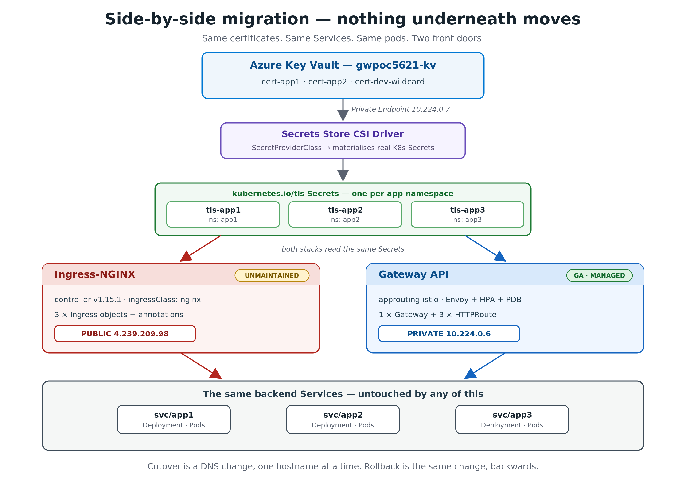
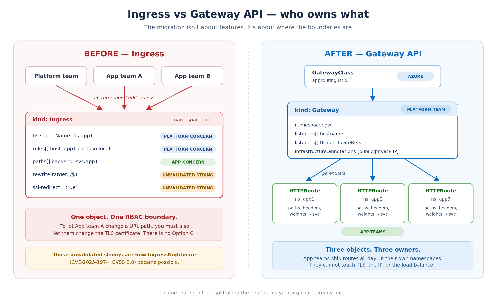

# AKS NGINX → Gateway API Migration POC

A field-validated, reproducible playbook that:

1. Deploys **NGINX Ingress** on an existing AKS cluster, serving **3 hostnames** with **3 TLS certificates** stored in **Azure Key Vault** (mounted via the Secrets Store CSI driver).
2. Deploys the **Kubernetes Gateway API**, **side-by-side**, using the **AKS App Routing add-on with the managed Istio implementation** (`gatewayClassName: approuting-istio`) — no manual CRD installs, no manual controller installs.
3. Validates both stacks with `curl --resolve` + .NET TLS handshake (no real DNS, no `openssl` required).
4. Performs a **logical cutover** with a parity check, keeping NGINX as a fallback reference.
5. Documents the **DNS cutover** + rollback procedure for production.

> **Migration is side-by-side, not in-place.** NGINX Ingress and the Gateway API run simultaneously, sharing the same backend Services. Cutover is per-hostname (DNS or `/etc/hosts`). Rollback = revert DNS.

The full step-by-step explanation lives in **[PLAYBOOK.md](PLAYBOOK.md)**.

---

## Topology



Both stacks read the **same** `kubernetes.io/tls` Secrets and route to the
**same** backend Services. The IPs shown are from the reference cluster this
POC was validated on: NGINX on a public IP, the Gateway on a private one.
Cutover is a DNS change, one hostname at a time; rollback is the same change,
backwards.

The ownership boundary this migration actually moves:



---

## Prerequisites

| Tool | Version |
|---|---|
| Azure CLI | 2.86.0+ (`az login`) — required for `--enable-gateway-api` and `--enable-app-routing-istio` |
| kubectl | 1.29+ |
| helm | 3.14+ |
| pwsh | 7+ |

AKS cluster requirements: OIDC issuer + Workload Identity enabled, KV Secrets Provider add-on, App Routing add-on with managed Gateway API. The playbook shows how to verify and enable each.

---

## Files

| Step | Script | Purpose |
|---|---|---|
| 0 | [00-variables.ps1](00-variables.ps1) | Central config — **edit first** (subscription, RG, AKS, hostnames) |
| 1 | [01-create-infra.ps1](01-create-infra.ps1) | Verify cluster add-ons, create Key Vault, assign RBAC roles |
| 2 | [02-generate-certs.ps1](02-generate-certs.ps1) | Generate 3 self-signed PFX certs (PowerShell, no openssl), import to KV |
| 3 | [03-install-nginx.ps1](03-install-nginx.ps1) | Helm install `ingress-nginx` |
| 4 | [04-deploy-apps-and-ingress.ps1](04-deploy-apps-and-ingress.ps1) | Deploy 3 apps + SecretProviderClass + syncer + Ingress per host |
| 5 | [05-validate-nginx.ps1](05-validate-nginx.ps1) | `curl --resolve` + .NET TLS SNI checks against NGINX |
| 7 | [07-deploy-gateway-and-routes.ps1](07-deploy-gateway-and-routes.ps1) | Gateway with 3 listeners + 3 HTTPRoutes + 3 ReferenceGrants (managed Istio) |
| 8 | [08-validate-gateway.ps1](08-validate-gateway.ps1) | Same validation pattern, against the Gateway |
| 9 | [09-cutover-keep-nginx.ps1](09-cutover-keep-nginx.ps1) | Side-by-side parity check; declare Gateway primary, **keep NGINX as reference** |
| 9b | [09b-decommission-nginx.ps1](09b-decommission-nginx.ps1) | Interactive: delete NGINX Ingress objects + uninstall the controller |
| 10 | [10-cleanup.ps1](10-cleanup.ps1) | Tear down POC resources — **review before running** |

Manifests live under [manifests/](manifests/).

Two extras that the scripts do not deploy, referenced by the blog post:

| Manifest | Purpose |
|---|---|
| [manifests/istio/gateway-keyvault-optiona.yaml](manifests/istio/gateway-keyvault-optiona.yaml) | **Option A** — the App Routing operator builds the Key Vault → TLS chain for you. No `SecretProviderClass`, no syncer Deployment, no `certificateRefs`; rotation via an unversioned KV URI. |
| [manifests/advanced/annotation-translations.yaml](manifests/advanced/annotation-translations.yaml) | Self-contained worked examples for `ssl-redirect`, `canary-weight`, `canary-by-header` and `rewrite-target`, each with its verified output recorded inline. |

The full narrative, including gotchas we hit and how we fixed them, is in **[PLAYBOOK.md](PLAYBOOK.md)**.

---

## Run order (happy path)

```powershell
# Edit 00-variables.ps1 first

./01-create-infra.ps1
./02-generate-certs.ps1
./03-install-nginx.ps1
./04-deploy-apps-and-ingress.ps1
./05-validate-nginx.ps1                # ✅ Phase 1: NGINX serving 3 hosts / 3 certs

./07-deploy-gateway-and-routes.ps1     # Gateway via approuting-istio
./08-validate-gateway.ps1              # ✅ Phase 2: Gateway serving same 3 hosts / 3 certs

./09-cutover-keep-nginx.ps1            # Parity report; both stacks remain live
# ./09b-decommission-nginx.ps1         # Run only when ready to retire NGINX
# ./10-cleanup.ps1                     # POC cleanup
```

---

## Why the AKS managed Istio path?

When AKS managed Gateway API is enabled, AKS owns the Gateway CRDs and a webhook (`managed-gateway-api-ccp-validating-webhook.azmk8s.io`) blocks user CRD modifications. The supported Microsoft route is to use the **App Routing add-on with the Istio Gateway API implementation**, which provides the `approuting-istio` `GatewayClass` out of the box. This is what the POC uses.

If you'd rather try **Application Gateway for Containers (AGC)** or **NGINX Gateway Fabric (NGF)**, the patterns in `07-deploy-gateway-and-routes.ps1` translate directly — only the `gatewayClassName` and the LB Service name change.

---

## NGINX → Gateway API conversion cheatsheet

| NGINX Ingress feature | Gateway API equivalent |
|---|---|
| `spec.tls[]` | `Gateway.listeners[].tls.certificateRefs` (per listener) |
| `spec.rules[].host` | `Gateway.listeners[].hostname` + `HTTPRoute.hostnames` |
| `pathType: Prefix` | `HTTPRoute.rules.matches.path.type: PathPrefix` |
| `nginx.ingress.kubernetes.io/rewrite-target` | `HTTPRoute` filter `URLRewrite` |
| `nginx.ingress.kubernetes.io/canary-weight` | `HTTPRoute.rules.backendRefs[].weight` |
| `nginx.ingress.kubernetes.io/ssl-redirect` | Listener on :80 with `HTTPRoute` filter `RequestRedirect{scheme: https}` |
| `nginx.ingress.kubernetes.io/configuration-snippet` | **No portable equivalent.** Use controller-specific extensions (Istio `EnvoyFilter`, AGC `RoutePolicy`, NGF `SnippetsFilter`). Gap to flag. |
| `auth-url` (external auth) | No Gateway API resource. Envoy `ext_authz` / controller-specific auth filter. |
| `backend-protocol: HTTPS`, `auth-tls-*` (mTLS to backend) | `BackendTLSPolicy` — **experimental channel** on Gateway API v1.3.0 (K8s 1.34), so unavailable here. Graduated to standard in v1.4.0 (K8s 1.35+). |

---

## What is NOT in this repo

- Real PFX files, private keys, `.poc-state` files (`.gitignore`d).
- Subscription, tenant, KV name, IP addresses — all read at runtime from your environment.
- The cluster itself — the POC runs against an existing AKS cluster.

---

## License

POC code provided as-is for customer reference. Adapt to your environment.
